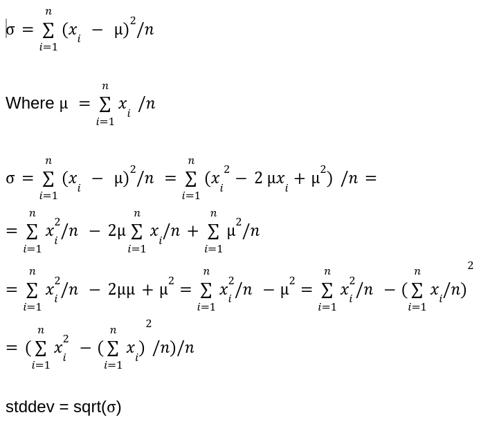

# Data Tracker

1. The app will query data from a publicly available source every 1 minute from
https://docs.cryptowat.ch/rest-api/ to get the latest cryptocurrency quotes.
2. The app will have a REST to enable the following user experience:
* Users will select one of the collected metrics (e.g. BTC/USD price).
* The selected metric will be presented in a chart over time (so as to show the
user how it changed throughout the last 24 hours).
* In addition, the application will present the selected metric's "rank". The "rank"
of the metric helps the user understand how the metric is changing relative to
other similar metrics, as measured by the standard deviation of the metric over
the last 24 hours. For example in the crypto data source, if the standard
deviations of the volume of BNT/BTC, GOLD/BTC and CBC/ETH were 100, 200
and 300 respectively, then rank(CBC/ETH)=1/3, rank(GOLD/BTC)=2/3 and
rank(BNT/BTC)=3/3.

## Requirements

* Make sure you have installed in the system https://www.docker.com
* Python 3.8 or higher

## Quick Start

```shell
cd ~
git clone https://github.com/yzhishko/data-tracker
cd data-tracker
docker build . -t data-tracker:1.0.0
docker run --rm -p 8080:8080 data-tracker:1.0.0
```

Navigate http://localhost:8080/app/v1/docs for list of APIs.

## Local & Debug

```shell
cd ~/data-tracker
```

Create and activate virtual environment:
```shell
python3 -m venv /path/to/new/virtual/environment
source /path/to/new/virtual/environment/bin/activate
```

Install poetry and uvicorn:

```shell
pip3 install setuptools
pip3 install poetry
pip3 install "uvicorn[standard]"
```

### Run Locally

```shell
PYTHONPATH=. poetry run python3 data_tracker/__main__.py
```

### Debug in PyCharm

* Import project
* File --> Setting --> Project: data-tracker --> Python Interpreter
* Click "Add Interpreter" and select "Add Local Interpreter"
* Choose "Poetry Environment"
* Set "/path/to/new/virtual/environment/bin/python3" as a Base Interpreter
* Set "/path/to/new/virtual/environment/bin/poetry" as a Poetry Executable
* Click "OK" and run "poetry update" from IDE
* Not you should be able to run and debug tests and data_tracker/__main__.py in your project

## Ranking Algorithm

In order to update a rank we need to compute sliding window standard deviation. This can be done in constant
time when we receive a new price. All we need to track last 24 hours records in a queue (remove expired
from a head of the queue and append a new one to the tail) and keep a sum of prices, sum of squares of
the prices and total count of signals in the queue 
see [StatAggregator](./data_tracker/server/controller/stat/stat_aggregator.py). See, the formula:


Once a new standard deviation received for a particular pair, we recompute ranks for all pairs. The number
of such pairs is limited and the update can be considered happening in constant time.
See [Ranker](./data_tracker/server/controller/stat/ranker.py)

## Scalability and Extensibility

* It's a single threaded async application that isn't intended to run on production especially under high load.
* The user requests will be blocked for a short time while statistic is computed. 
* Also, the progress (the queue state) will be lost if the application fails. 
* Apart off that, in applications like this, users are interested to receive updates more frequently and only if prices 
changes. This approach doesn't scale well using regular pull requests, because we need to open and close connections 
frequently, especially if multiple currencies are monitored.

### Solution

#### CryptoWatcher Worker as a Service
* The CryptoWatcher worker may can be segregated in a separate service. We may have multiple instances of them for the
purpose of scalability, each one is responsible to receive updates for a specific subset of pairs, as they can be added
and removed dynamically as pairs may appear on and removed from a market. Instead of using periodic pulls to get the 
latest price it's better to switch to a web-socket connection and receive server side push events whenever the price
changes. The CryptoWatcher will save the event in highly-available and distributed timeseries database, that are
perfectly adjusted to the time-series data. 
* After the safe is done the price with a time will be published to a
highly-available distributed queue for a pair we received an event for. It's possible that a single instance of the
CryptoWatch worker may fail at some point of time. For that purpose we may preserve a copy of the watcher, for example,
using ZooKeeper, so if the web-socket connection fails, the copy becomes a new lead and establishes a new connection.

#### PriceTracker as a Service
* A separate PriceTracker service is subscribing for a specific crypto pair queue(s) and starts to receive price 
updates for those pairs. User also establishes a web-socket connection with PriceTracker and sends the pair(s) he/she
is interested in. Potentially we may have millions of users connected to the system at the same time, so we are going to
have multiple PriceTracking services allocated. Assuming that each service may have about 10000 simultaneously opened
connections at max, we may have thousands instances of PriceTracker running. That means we need to place a Load Balancer
between user clients and PriceTracker. Ideally we want users watching the same pair reside on the same PriceTracker
service, so we will have fewer subscribers for the same queue, means that Round-and-Robin is not a good choice for LB.
The better way is to use consistent hashing instead and use pair name(s) as a hash.
* In addition, once the number of connections getting closer to 10000 for a particular server (80% threshold, 
for example). We can dynamically add service that would serve the same hashes and LB will start to redirect 
new connections there, which would be exceptionally helpful for popular pairs (some of those pairs can eventually 
be segregated and have dedicated PriceTracker, for example, BTCUSD or ETHUSD).
* Once user establishes a web-socket connection with a particular PriceTracker, the PriceTracker will subscribe to a
specific queue for latest price updates (if it's not already subscribed) and download the latest 24 hours of prices 
from TSDB (this data can be also cached in PriceTracker memory and updated for faster access of subsequent connections).
The 24 hours data will be immediately sent to the user and new price updates will be pushed (including all other 
web-socket clients watching for the same pair).

#### Statistics as Services
* If some statistic is required (sliding window MIN, MAX, AVERAGE, STD_DEVIATION, etc.). We can add a new
group of StatisticUpdate workers that would compute those values on a fly by subscribing to specific pair price queue(s) 
and put those values in distributed cache. User client may request those values using regular pull method if no life 
update is required since those values computed asynchronously, otherwise the logic should be embedded in PriceTracker 
service.
* For historical statistical data TSDB should be used

#### Ranking
* User local price rank is calculated based on STD_DEVIATION of pairs user is monitoring and can be obtained on a flight
(if logic is embedded in PriceTracker) or through Statistic Services, in a case of async compute.
* Global price rank would require knowledge about all STD_DEVIATION of all pair in the system. We can run a periodic job
(every few seconds or so) that would grab STD_DEVIATION, compute ranks and put them in distributed cache. The data will
be available through Statistic Services

#### Detection Services
* Such service may be used to detect anomalies in data (spikes, dips, abnormal deviations). They are subscribed to
pair price queue(s) similar to StatisticUpdate worker and push special message to a separate queue(s). Since, those
messages are really important we may use a different durable queue type for publishing.

#### Alert Services
* Alert service may subscribe to durable queues that Detection Services are publishing to and send realtime and
non-realtime notifications for users.

View architecture diagram [here](https://lucid.app/lucidspark/22dfdf6a-d9d6-4bb4-99c1-4e12bce44cb8/edit?viewport_loc=-224%2C-336%2C1920%2C984%2C0_0&invitationId=inv_7e881844-292d-48c1-80cb-02b81814589b#)

### Regional Scale

The described system can be deployed in multiple regions across the globe and Load Balanced based on user location.

__IMPORTANT__: all components should be synced via [NTP](https://en.wikipedia.org/wiki/Network_Time_Protocol) protocol.

## Testing
* Apart off unit tests each component can be covered with integration tests. The input and output can be mocked by
test services, queues, etc.
* In addition, the whole system can be covered with E2E, performance, scalability tests before production release.
* A/B testing in production will be also valuable

## Staging/Production release
* Each service can be released using Rolling Update strategy and should always be backward compatible with other
services.

## Total time took:
About 8 hours